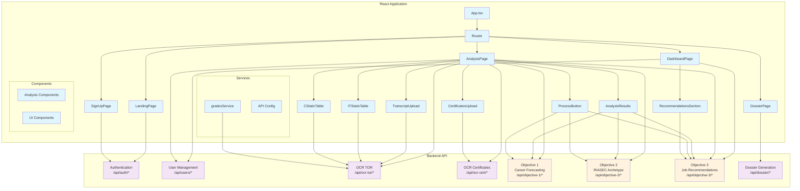
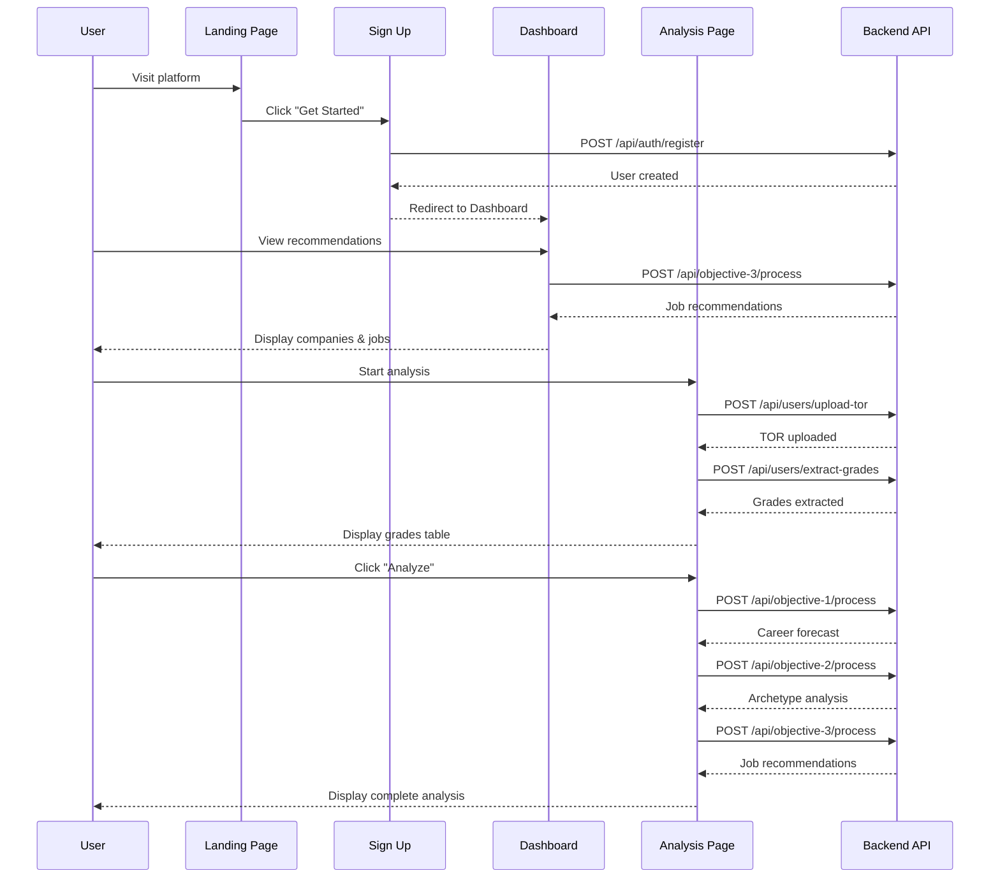

# Gradalyze Frontend

Frontend for the Gradalyze academic profiling and career recommendation platform built with React, TypeScript, and Vite.

## 🏗️ Frontend Architecture



## 🔄 User Journey Flow



## 📁 Project Structure

```
frontend/
├── src/
│   ├── pages/                    # Main application pages
│   │   ├── LandingPage.tsx       # Homepage
│   │   ├── DashboardPage.tsx     # User dashboard
│   │   ├── AnalysisPage.tsx      # Analysis workflow
│   │   ├── DossierPage.tsx       # Portfolio generation
│   │   └── SignUpPage.tsx        # User registration
│   ├── analyiscomponents/        # Analysis-specific components
│   │   ├── TranscriptUpload.tsx  # TOR document upload
│   │   ├── CertificatesUpload.tsx # Certificate upload
│   │   ├── ITStaticTable.tsx     # IT program grade table
│   │   ├── CStaticTable.tsx      # CS program grade table
│   │   ├── AnalysisResults.tsx   # Results display
│   │   ├── ProcessButton.tsx     # Analysis trigger
│   │   └── RecommendationsSection.tsx # Job recommendations
│   ├── services/                 # API service layer
│   │   └── gradesService.ts      # Grade management
│   ├── config/                   # Configuration
│   │   └── api.ts               # API endpoints & URLs
│   ├── App.tsx                   # Main app component
│   └── main.tsx                  # Application entry point
├── package.json                  # Dependencies
├── vite.config.ts               # Vite configuration
└── README.md                    # This file
```

## 🚀 Quickstart

### Prerequisites
- Node.js 18+
- Backend API running on port 5000

### Installation
   ```bash
   npm install
   ```

### Environment Configuration
Create `.env.local` in the frontend directory:
   ```env
   VITE_API_BASE_URL=http://localhost:5000
   VITE_NODE_ENV=development
   ```

### Development
   ```bash
   npm run dev
# App runs on http://localhost:5173
```

## 📋 Available Scripts

- `npm run dev` – Start Vite development server
- `npm run build` – Production build
- `npm run preview` – Preview production build locally
- `npm run lint` – Run ESLint

## 🎯 Key Features

### **Authentication Flow**
- User registration and login
- JWT token management
- Protected routes

### **Document Processing**
- TOR (Transcript of Records) upload
- Certificate upload
- OCR text extraction
- Grade table population

### **Analysis Pipeline**
- **Objective 1:** Career forecasting based on grades
- **Objective 2:** RIASEC archetype classification
- **Objective 3:** Job and company recommendations
- Real-time analysis results

### **Portfolio Generation**
- Professional dossier creation
- PDF generation and download
- Shareable portfolio links

## 🔌 API Integration

### **Authentication Endpoints**
```typescript
POST /api/auth/register    // User registration
POST /api/auth/login       // User login
GET  /api/auth/profile     // Get user profile
```

### **User Management**
```typescript
GET  /api/users/           // List users
POST /api/users/           // Create user
GET  /api/users/<id>       // Get user by ID
PUT  /api/users/<id>       // Update user
```

### **OCR Processing**
```typescript
POST /api/users/upload-tor        // Upload TOR document
POST /api/users/extract-grades    // Extract grades from TOR
POST /api/ocr-cert/extract-text   // Extract certificate text
```

### **Analysis Objectives**
```typescript
POST /api/objective-1/process     // Career forecasting
POST /api/objective-2/process     // RIASEC archetype
POST /api/objective-3/process     // Job recommendations
```

### **Portfolio Generation**
```typescript
POST /api/dossier/generate        // Generate dossier
GET  /api/dossier/download        // Download dossier
GET  /api/dossier/preview         // Preview dossier
```

## 🎨 UI Components

### **Pages**
- **LandingPage:** Homepage with platform overview
- **DashboardPage:** User dashboard with recommendations
- **AnalysisPage:** Complete analysis workflow
- **DossierPage:** Portfolio generation and management
- **SignUpPage:** User registration and login

### **Analysis Components**
- **TranscriptUpload:** TOR document upload with OCR
- **CertificatesUpload:** Certificate document upload
- **ITStaticTable/CStaticTable:** Grade input tables
- **AnalysisResults:** Display analysis outcomes
- **ProcessButton:** Trigger analysis workflow
- **RecommendationsSection:** Job and company suggestions

## 🔧 Configuration

### **API Configuration (`src/config/api.ts`)**
```typescript
export const API_CONFIG = {
  BASE_URL: import.meta.env.VITE_API_BASE_URL || 'http://localhost:5000',
  ENDPOINTS: {
    // Authentication
    LOGIN: '/api/auth/login',
    SIGNUP: '/api/auth/register',
    
    // User management
    USERS: '/api/users',
    UPLOAD_TOR: '/api/users/upload-tor',
    EXTRACT_GRADES: '/api/users/extract-grades',
    
    // Analysis objectives
    OBJECTIVE_1_PROCESS: '/api/objective-1/process',
    OBJECTIVE_2_PROCESS: '/api/objective-2/process',
    OBJECTIVE_3_PROCESS: '/api/objective-3/process',
    
    // Portfolio generation
    DOSSIER_GENERATE: '/api/dossier/generate',
  }
};
```

## 🚀 Deployment

### **Vercel Deployment**
1. Connect your repository to Vercel
2. Configure environment variables:
   - `VITE_API_BASE_URL` – Your backend API URL
   - `VITE_NODE_ENV=production`
3. Deploy automatically on push

### **Static Hosting**
```bash
npm run build
# Deploy the `dist/` folder to your static host
```

### **Environment Variables**
- `VITE_API_BASE_URL` – Backend API base URL
- `VITE_NODE_ENV` – Environment (development/production)

## 🐛 Troubleshooting

### **Common Issues**
- **CORS errors:** Ensure backend CORS is configured and `VITE_API_BASE_URL` is correct
- **404 on refresh:** Configure your host to serve `index.html` for SPA routing
- **Environment variables not loading:** Restart dev server after changing `.env` files
- **API connection issues:** Verify backend is running and accessible

### **Development Tips**
- Use browser dev tools to inspect API calls
- Check network tab for failed requests
- Verify environment variables in console
- Ensure backend endpoints match frontend calls

## 📊 Current Status

- ✅ **React 18** with TypeScript
- ✅ **Vite** for fast development
- ✅ **Tailwind CSS** for styling
- ✅ **API integration** with backend
- ✅ **Analysis workflow** complete
- ✅ **Portfolio generation** functional
- ✅ **Responsive design** for all devices

## 🔮 Future Enhancements

- [ ] Real-time analysis updates
- [ ] Advanced data visualization
- [ ] Mobile-optimized interface
- [ ] Offline capability
- [ ] Progressive Web App (PWA)
- [ ] Advanced filtering and search

---

**Built with ❤️ for academic career guidance**